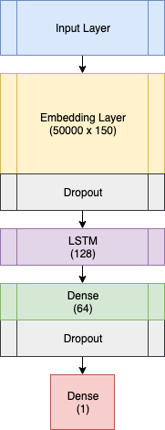

# Sentiment Classification


We will be training a LSTM model using the reconstructed version of our compressed embeddings.

<p align="center"> 

</p>

Post training, we remove the embeddings layer from our sequential model and convert it the TensorflowJS layers format.
## Demo
You can find the demo on this [page](https://mb-14.github.io/embeddings.js/models/sentiment_classification/demo)


## Instructions

### Downloading training data

We will be using the [sentiment140 dataset](http://help.sentiment140.com/home) for training our classification model.
Download the dataset from this [link](http://cs.stanford.edu/people/alecmgo/trainingandtestdata.zip) and extract the contents in the `data` folder

### Training
Run `sentiment_lstm.py` to train the model and convert it to the tensorflowjs format.
The `-i` flag should point to the pre-trained word embeddings to use for our LSTM model.

```bash
 python sentiment_lstm.py -i ../compressor/generated/embeddings-150d-50K.vec
```

## Benchmarks

|             Word embeddings             	| Accuracy  	|
|:---------------------------------------:	|:---------:	|
|         FastText Pretrained 300D        	|    78.95%    	|
| Compressed Vectors (Reconstructed) 150D 	|   77.5%   	|